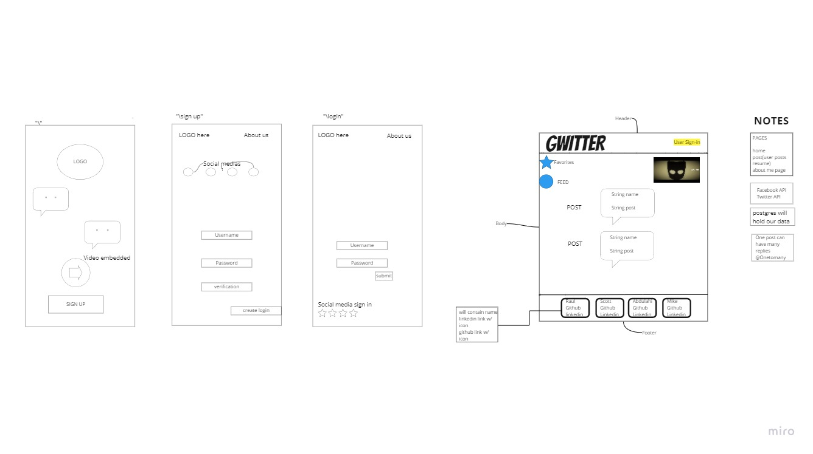

# Gwiter

- Social media and news App 

## Feature tasks
### AI social media feature
- Smart social media app that detects negative comments and avoids them.
- posts recommended restaurants based on location and ingredients (voice or pictures)
- uses its own local models to utilize fast, responsive, secure learning features.
### Other social media Feature Tasks
- twitter, tiktok, facebook, instagram sign in for secure and ease of access
- post and reply to comments
- view twitter, facebook, tiktok content.
****

## Port Instructions
- postgres should be enabled for project by creating a database
  - [create a application.properties withing resources.](src/main/resources/static/img/instructions1.JPG)
- we used the basic Thyme leaf dependencies (included)
****
### Instructions - start a app
1. Clone
2. build gradle
3. The app will allow you to create an account and conitnues with website using jBCrypt!
4. we used intellij to start our Spring boot and gradle.
5. after building and running gradle, you should be ablet o use web App!

****
### Flow of Program

[//]: # (- Front end Flow ![]&#40;src/main/resources/static/img/Flow1.jpg&#41;)
- Front end Flow 
- WebPage design 
- BackEnd Flow 
****

### Links and Resources
- jBCrypt is a Java implementation of OpenBSD's Blowfish Password hashing code, as described in "http://www.openbsd.org/papers/bcrypt-paper.ps" by Niels Provos and David Mazieres.
- more info: [JBCRYPT - Website](https://www.mindrot.org/projects/jBCrypt/)
- The site should have a login page.
  The login page should have a link to a signup page.
  An ApplicationUser should have a username, password (will be hashed using BCrypt), firstName, lastName, dateOfBirth, bio, and any other fields you think are useful.
  All of these fields must be set at signup. They will not be editable at any other time.
  The site should allow users to create an ApplicationUser on the “sign up” page.
  Your Controller should have an @Autowired private PasswordEncoder passwordEncoder; and use that to run passwordEncoder.encode(password) before saving the password into the new user.

## Contributors:
****
- code referenced from Alex White  [gitHub](https://github.com/codefellows/seattle-code-java-401d12)
****
